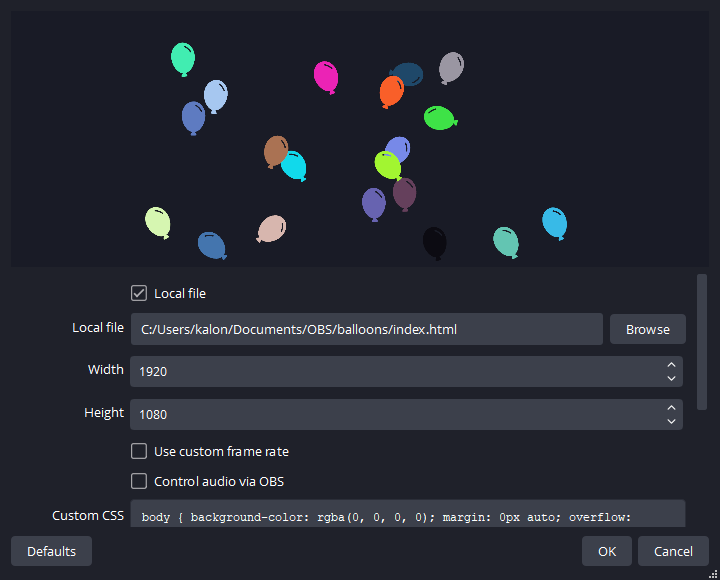

# OBS Animations
 Processing "p5.js" randomized, live animations for loading screens, BRB screens, or whatever else people find useful.

# Downloading and Using
For whichever animation(s) you want to use, download the entire folder for that specific animation.

Once you have it downloaded, add a Browser Source in OBS.

* Check the box for "local file" and click Browse. Navigate to the folder you downloaded, and select "index.html" from the folder.
* I think it works best to set the height and width to whatever your OBS canvas is (aka full screen), but you can obviously mess around with this if you like.

* The default Custom CSS is fine, you can just leave that alone.
* I would recommend checking the box for "Shutdown source when not visible" just so the animation isn't calculating everything in the background while you're not using it. I don't think any of these would really be a problem if you leave them on in the background, but just to be nice to your computer.

# Previews
These previews all have something in the background just so you can see the animations on top of an example stream screen. Don't worry about any of the backgrounds, they won't be included.

### Balloons
https://github.com/kaloncpu57/OBS-Animations/blob/main/previews/balloons.mp4?raw=true

### Cyberspace
https://github.com/kaloncpu57/OBS-Animations/blob/main/previews/cyberspace.mp4?raw=true

### DVD Logo
https://github.com/kaloncpu57/OBS-Animations/blob/main/previews/dvd-logo.mp4?raw=true

### Matrix
https://github.com/kaloncpu57/OBS-Animations/blob/main/previews/matrix.mp4?raw=true

### Solitaire
https://github.com/kaloncpu57/OBS-Animations/blob/main/previews/solitaire.mp4?raw=true
